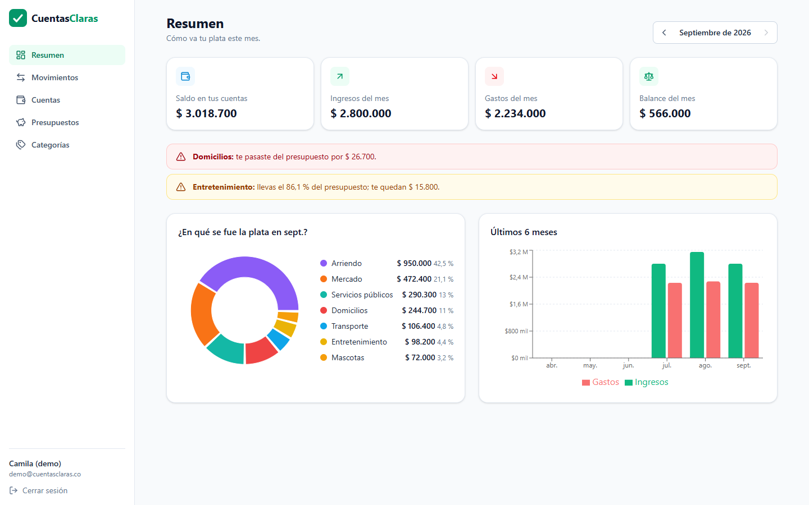
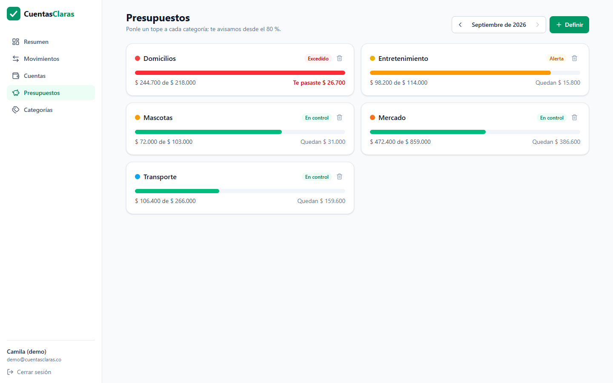
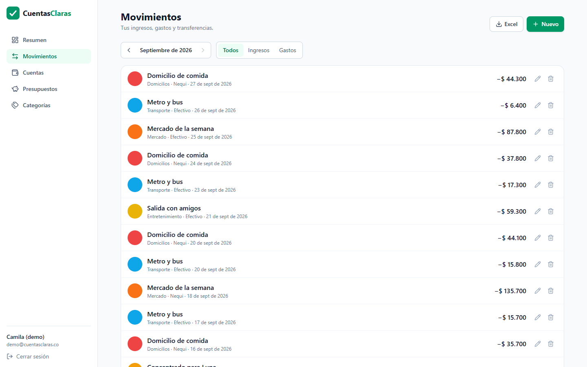
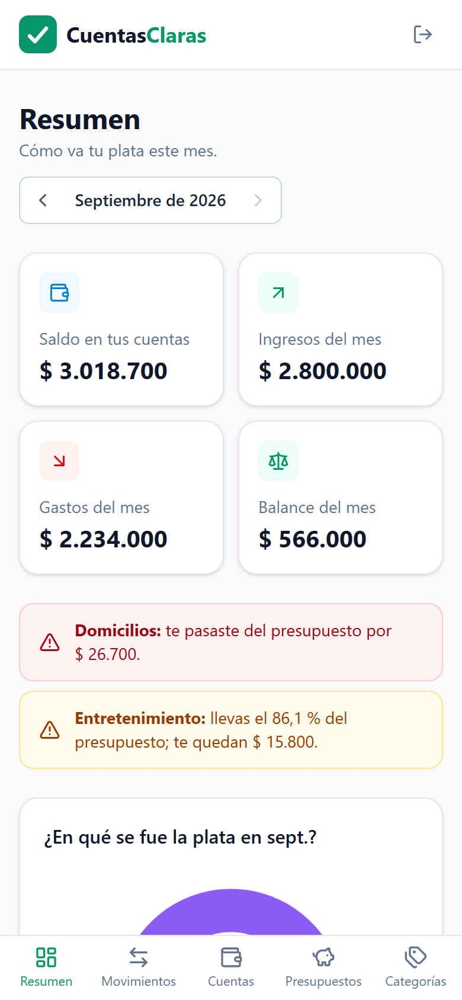

# CuentasClaras


> *"Cuentas claras, amistades largas."*

App de finanzas personales para quien maneja su plata repartida entre efectivo, Nequi, Daviplata y el banco. Registras lo que entra y sale de cada cuenta, te pones un presupuesto por categoría y la app te avisa antes de que te pases.

El diseño completo (historias de usuario, reglas de negocio, modelo de datos y plan de trabajo) está en [`docs/01-diseno.md`](docs/01-diseno.md).



| Presupuestos con semáforo | Movimientos | En el celular |
|---|---|---|
|  |  |  |

## Stack

| Capa | Tecnologías |
|---|---|
| API | Java 21, Spring Boot 4, Spring Security (OAuth2 Resource Server + JWT), Spring Data JPA, Bean Validation |
| Datos | PostgreSQL 16, Flyway (migraciones) |
| Pruebas | JUnit 5, MockMvc, Testcontainers (PostgreSQL real en Docker) |
| Frontend | React 19, Vite, Tailwind CSS 4, React Router, Recharts |
| CI | GitHub Actions |

## Cómo correrlo en local

Requisitos: JDK 21 y Docker Desktop.

```bash
# 1. Base de datos (queda en el puerto 5433)
docker compose up -d

# 2. API en http://localhost:8080
cd backend
./mvnw spring-boot:run
```

Comprueba que está viva: `http://localhost:8080/actuator/health` → `{"status":"UP"}`

## Autenticación

| Método | Ruta | Descripción |
|---|---|---|
| POST | `/api/auth/registro` | Crea la cuenta y devuelve un JWT |
| POST | `/api/auth/login` | Devuelve un JWT |
| GET | `/api/auth/yo` | Datos de la persona autenticada (requiere `Authorization: Bearer <token>`) |

### Cuentas y categorías

| Método | Ruta | Descripción |
|---|---|---|
| GET | `/api/cuentas?incluirArchivadas=false` | Cuentas propias con saldo actual calculado |
| GET / PUT | `/api/cuentas/{id}` | Ver / editar |
| POST | `/api/cuentas` | Crear (nombre, tipo, saldo inicial) |
| DELETE | `/api/cuentas/{id}` | Elimina si no tiene movimientos; si tiene, la archiva |
| PATCH | `/api/cuentas/{id}/restaurar` | Desarchivar |
| GET | `/api/categorias?tipo=GASTO` | Por defecto + propias |
| POST / PUT / DELETE | `/api/categorias[/{id}]` | Solo categorías propias; las por defecto dan 403 |

Cada persona solo ve y modifica lo suyo: pedir un recurso ajeno responde 404, igual que si no existiera.

### Movimientos

| Método | Ruta | Descripción |
|---|---|---|
| GET | `/api/movimientos?desde=&hasta=&cuentaId=&categoriaId=&tipo=&pagina=0&tamano=20` | Filtrado y paginado, lo más reciente primero |
| POST / PUT / DELETE | `/api/movimientos[/{id}]` | Ingresos y gastos |
| POST | `/api/transferencias` | Mueve plata entre cuentas propias: dos movimientos en una sola transacción |
| GET / DELETE | `/api/transferencias/{id}` | Ver / eliminar (borra las dos partes juntas) |

### Presupuestos y reportes

| Método | Ruta | Descripción |
|---|---|---|
| GET | `/api/presupuestos?mes=2026-09` | Presupuestos del mes con gastado, disponible, % usado y estado (EN_CONTROL / ALERTA desde 80 % / EXCEDIDO desde 100 %) |
| PUT | `/api/presupuestos` | Crea o actualiza el tope de una categoría de gasto en un mes |
| DELETE | `/api/presupuestos/{id}` | Elimina |
| GET | `/api/resumen?mes=2026-09` | Ingresos, gastos, balance, gasto por categoría y alertas |
| GET | `/api/resumen/tendencia?meses=6` | Ingresos y gastos de los últimos meses |
| GET | `/api/movimientos/exportar?mes=2026-09` | CSV para Excel (separador `;`, coma decimal, con BOM) |

Si no se indica el mes, se usa el mes actual en hora de Colombia.

Documentación interactiva: `http://localhost:8080/swagger-ui.html` (botón **Authorize** para pegar el token).

Los errores siguen el estándar RFC 9457 (`application/problem+json`): `{ "status", "title", "detail" }`, y en validaciones un objeto `errores` por campo.

## Despliegue

| Capa | Servicio | Configuración |
|---|---|---|
| Frontend | Vercel | Carpeta `frontend`, variables `VITE_API_URL` y `VITE_MODO_DEMO=true` |
| API | Render (Docker, Ohio) | Definida en [`render.yaml`](render.yaml); imagen multi-etapa en [`backend/Dockerfile`](backend/Dockerfile), sin root |
| Base de datos | Neon, PostgreSQL 16 (Ohio) | `DATABASE_URL` se pega tal como la da Neon; la API la convierte a JDBC |

Con el perfil `demo`, la API recrea en cada arranque la cuenta **demo@cuentasclaras.co** (contraseña `Demo2026!`) con tres meses de movimientos hasta hoy. No toca los datos de nadie más.

## Pruebas

```bash
cd backend
./mvnw verify
```

No necesitan la base de docker compose: Testcontainers levanta su propio PostgreSQL 16 en Docker, aplica las migraciones y lo borra al terminar.

## Avance

- [x] Diseño
- [x] Esqueleto: Spring Boot, PostgreSQL, Flyway, seguridad base, CI
- [x] Registro e inicio de sesión (JWT)
- [x] Cuentas y categorías
- [x] Movimientos
- [x] Transferencias
- [x] Presupuestos y resumen mensual
- [x] Frontend (React)
- [ ] Despliegue y demo

---

Proyecto de portafolio de **Manuela Córdoba Robledo**, aprendiz de Análisis y Desarrollo de Software (SENA).
