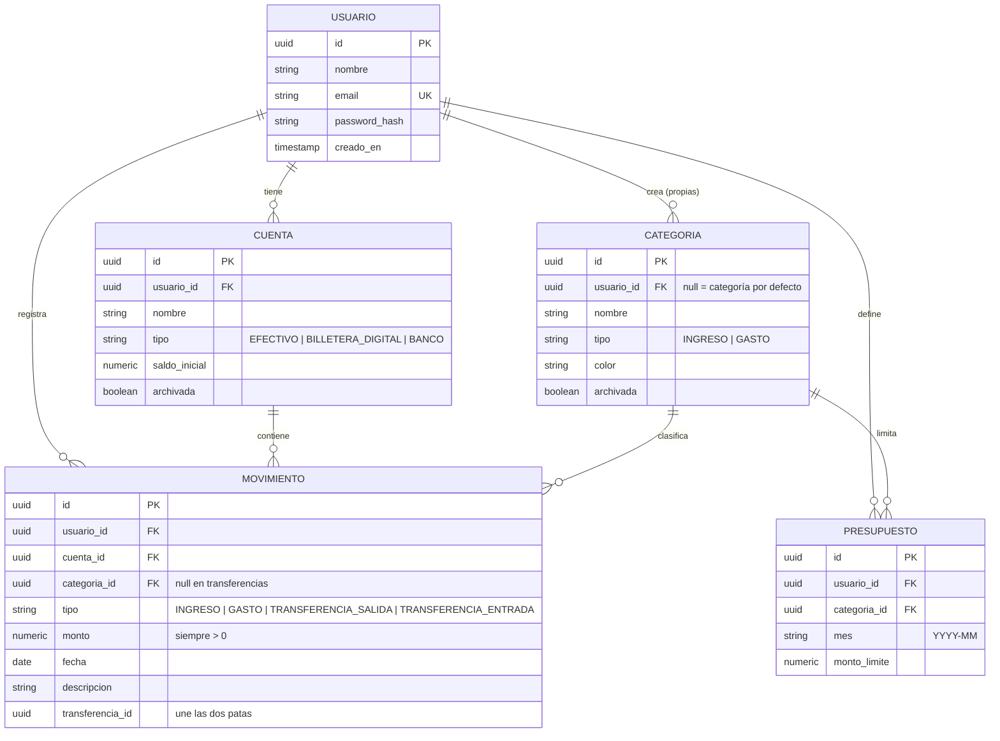

# CuentasClaras: documento de diseño

> *"Cuentas claras, amistades largas."*

## 1. El problema

Mucha gente en Colombia maneja su plata repartida entre efectivo, Nequi, Daviplata y una cuenta de banco, y a fin de mes no sabe en qué se le fue. Las apps de los bancos solo muestran lo que pasa por ese banco; el efectivo y las otras billeteras quedan por fuera.

**CuentasClaras** reúne todo en un solo lugar: registras lo que entra y lo que sale de cada "bolsillo", te pones un presupuesto por categoría y la app te avisa antes de que te pases.

## 2. Alcance (versión 1)

**Incluye:**
- Registro e inicio de sesión.
- Cuentas propias (efectivo, Nequi, banco…) con su saldo calculado.
- Categorías de ingreso y de gasto: unas vienen por defecto y cada persona puede crear las suyas.
- Movimientos (ingresos y gastos) con filtros por fecha, cuenta y categoría, y paginación.
- Transferencias entre cuentas propias (ej. retirar del banco a efectivo).
- Presupuesto mensual por categoría con alertas al 80 % y al 100 %.
- Resumen del mes: total de ingresos, total de gastos, gasto por categoría y evolución de los últimos 6 meses.
- Exportar los movimientos de un mes a CSV (para abrir en Excel).

**No incluye (a propósito):** conexión con bancos reales, varias monedas ni cuentas compartidas entre personas.

## 3. Historias de usuario

| ID | Como… | Quiero… | Para… |
|---|---|---|---|
| HU-01 | persona nueva | registrarme con correo y contraseña | tener mis finanzas privadas |
| HU-02 | usuaria | crear mis cuentas (efectivo, Nequi, banco) con un saldo inicial | reflejar dónde está mi plata hoy |
| HU-03 | usuaria | registrar un gasto o un ingreso en una cuenta y una categoría | saber en qué se me va la plata |
| HU-04 | usuaria | pasar plata de una cuenta a otra | que el retiro del cajero no cuente como gasto |
| HU-05 | usuaria | ver y filtrar mis movimientos | encontrar un gasto rápido |
| HU-06 | usuaria | ponerme un presupuesto mensual por categoría | no gastar de más en domicilios, por ejemplo |
| HU-07 | usuaria | ver una alerta cuando voy por el 80 % o me pasé | reaccionar a tiempo |
| HU-08 | usuaria | ver el resumen del mes con gráficas | entender mis hábitos |
| HU-09 | usuaria | descargar mis movimientos en CSV | llevarlos a Excel |

## 4. Reglas de negocio

| ID | Regla |
|---|---|
| RN-01 | Cada persona solo puede ver y modificar **sus propios** datos. Si pide un recurso de otra persona, la API responde 404 (no 403), para no revelar que existe. |
| RN-02 | Los montos se guardan como `NUMERIC(14,2)` en la base de datos y `BigDecimal` en Java. **Nunca `double`**: con decimales binarios, 0.1 + 0.2 no da 0.3 exacto, y con plata eso es un error. |
| RN-03 | Todo movimiento tiene monto **mayor que cero**. Si es gasto o ingreso lo dice el tipo, no el signo. |
| RN-04 | El saldo de una cuenta **no se guarda**: se calcula con saldo inicial + ingresos − gastos ± transferencias. Así nunca queda desincronizado. |
| RN-05 | Una transferencia son dos movimientos (salida y entrada) que se crean en **una sola transacción**: se guardan los dos o ninguno. Origen y destino deben ser distintos y de la misma persona. |
| RN-06 | Las transferencias **no cuentan** como ingreso ni como gasto en el resumen ni en los presupuestos. |
| RN-07 | La categoría de un movimiento debe ser del mismo tipo (una categoría de gasto no sirve para un ingreso). |
| RN-08 | Solo puede haber un presupuesto por categoría y mes. |
| RN-09 | "El mes" se calcula en hora de Colombia (America/Bogota), no en UTC. |
| RN-10 | No se puede borrar una cuenta o categoría que tenga movimientos: se **archiva** para que no aparezca en los formularios, pero el historial se conserva. |

## 5. Modelo de datos



## 6. API (resumen)

Todas bajo `/api`, con JWT salvo registro y login. Documentación interactiva en `/swagger-ui.html`.

| Método | Ruta | Descripción |
|---|---|---|
| POST | `/auth/registro`, `/auth/login` | Registro e inicio de sesión |
| GET / POST / PUT / DELETE | `/cuentas` | Cuentas con saldo calculado (DELETE archiva) |
| GET / POST / PUT / DELETE | `/categorias` | Por defecto + propias |
| GET / POST / PUT / DELETE | `/movimientos` | Filtros `desde`, `hasta`, `cuentaId`, `categoriaId`, `tipo`; paginado |
| POST | `/transferencias` | Crea las dos patas en una transacción |
| GET / PUT | `/presupuestos?mes=YYYY-MM` | Presupuestos del mes con lo gastado y el % usado |
| GET | `/resumen?mes=YYYY-MM` | Totales, gasto por categoría y alertas |
| GET | `/resumen/tendencia?meses=6` | Ingresos y gastos de los últimos meses |
| GET | `/movimientos/exportar?mes=YYYY-MM` | CSV |

## 7. Arquitectura y stack

Tres capas, igual que RitmoApp, pero en el ecosistema Java:

| Capa | Tecnología | Por qué |
|---|---|---|
| API | Java 21 + Spring Boot 3 | El estándar en banca y fintech |
| Seguridad | Spring Security + JWT + BCrypt | Autenticación sin estado |
| Datos | Spring Data JPA + PostgreSQL 16 | Mismo motor que RitmoApp |
| Migraciones | Flyway | Versionar la base de datos como el código |
| Validación | Bean Validation (`@NotNull`, `@Positive`…) | Reglas de entrada declarativas |
| Documentación | springdoc-openapi (Swagger UI) | Cualquiera puede probar la API desde el navegador |
| Pruebas | JUnit 5 + MockMvc + Testcontainers | Pruebas contra un PostgreSQL real en Docker |
| Frontend | React + Vite + Recharts | Las gráficas del resumen |
| Infraestructura | Docker, GitHub Actions, Render, Vercel, Neon | El mismo flujo que ya dominas |

Paquetes del backend organizados **por funcionalidad** (no por capa), para que cada módulo tenga junto su controlador, servicio, repositorio y DTOs:

```
co.cuentasclaras
├── auth/          registro, login, JWT
├── cuenta/
├── categoria/
├── movimiento/    incluye transferencias y exportación CSV
├── presupuesto/
├── resumen/
└── comun/         errores, seguridad, configuración
```

## 8. Plan de trabajo (una rama y un Pull Request por paso)

| # | Rama | Entrega |
|---|---|---|
| 1 | `feature/esqueleto` | Proyecto Spring Boot, Docker Compose con PostgreSQL, Flyway, CI con GitHub Actions, endpoint de salud |
| 2 | `feature/auth` | Registro, login, JWT, errores en formato uniforme |
| 3 | `feature/cuentas-categorias` | CRUD con aislamiento por usuario (RN-01) y categorías por defecto |
| 4 | `feature/movimientos` | CRUD, filtros, paginación, saldo calculado (RN-02 a RN-04, RN-07) |
| 5 | `feature/transferencias` | Transacción atómica (RN-05, RN-06) |
| 6 | `feature/presupuestos-resumen` | Presupuestos, alertas y resumen mensual (RN-08, RN-09) |
| 7 | `feature/frontend` | React con dashboard y gráficas |
| 8 | `feature/despliegue` | Render + Neon + Vercel, demo con datos de ejemplo, README con capturas |

Cada paso incluye sus pruebas y no se une a `main` sin CI en verde.
